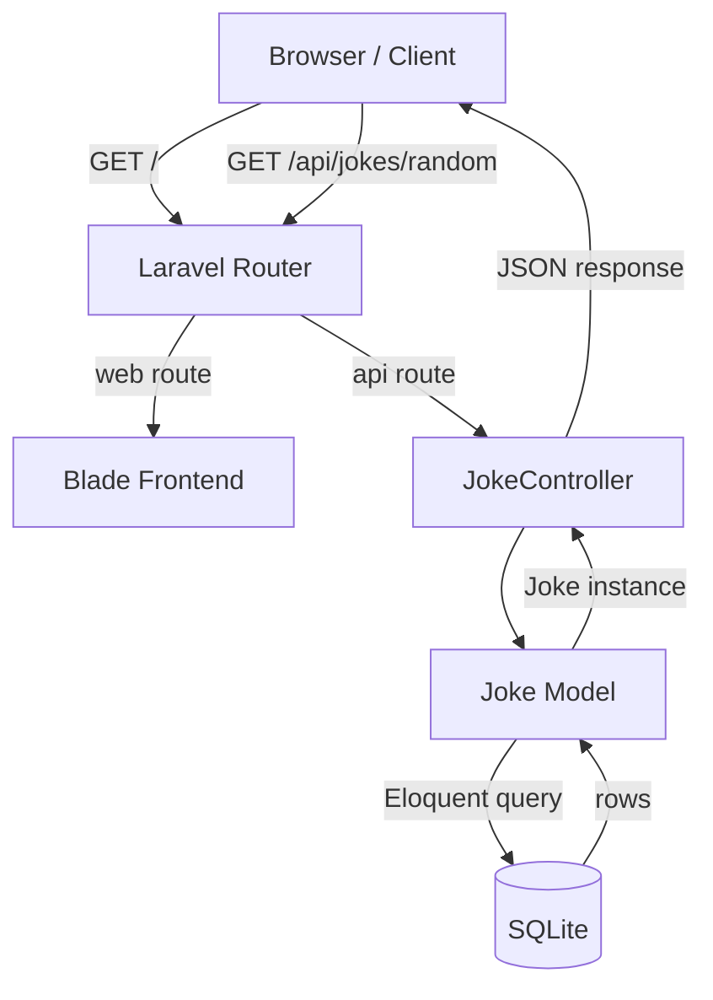
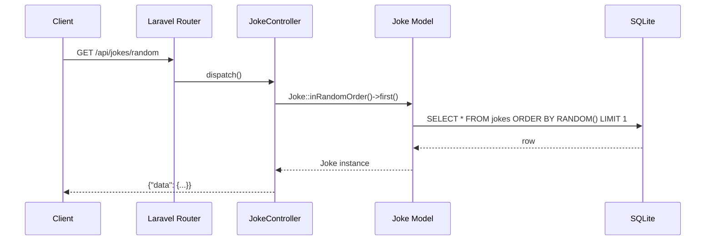

# 💰 Financial Jokes API

A lightweight REST API providing financial jokes tailored with Malaysian nuances and cultural context.

## 🌐 Live Demo
[https://financial-jokes-api-main-5lxhou.free.laravel.cloud/](https://financial-jokes-api-main-5lxhou.free.laravel.cloud/)

## 🚀 Quick Start

### Prerequisites
- PHP 8.3+
- Composer

### Installation
1. Clone the repository
2. Install dependencies:
   ```bash
   composer install
   ```
3. Setup environment:
   ```bash
   cp .env.example .env
   php artisan key:generate
   ```
4. Setup database and seed jokes:
   ```bash
   php artisan migrate --seed
   ```
5. Start server:
   ```bash
   php artisan serve --port=8001
   ```

## 🛠 Technical Stack
- **Framework:** Laravel 13
- **Language:** PHP 8.3
- **Database:** SQLite

## 📡 API Documentation

| Endpoint | Method | Description |
| :--- | :--- | :--- |
| `/api/jokes` | `GET` | Returns a list of all financial jokes. |
| `/api/jokes/random` | `GET` | Returns one random financial joke. |

## 🎨 Frontend
The project includes a simple UI to browse jokes.
Access it at: `http://127.0.0.1:8001/`

## 🗺 Architecture

### System Overview


### API Request Flow


## 🎯 Goal
Provide developers and social media managers with humorous, culturally relevant financial content for the Malaysian market.
